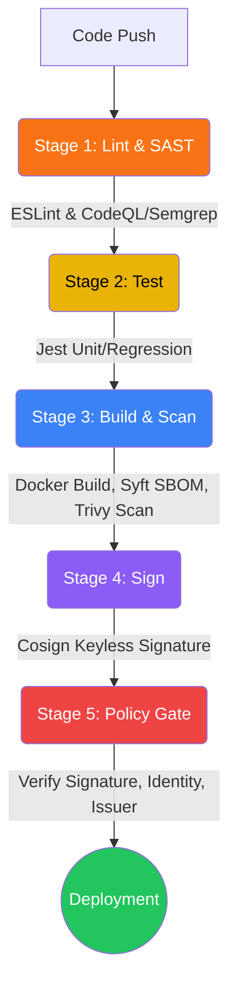

# Architecture

This project implements a Zero-Trust DevSecOps pipeline. The core concept is that a container image is untrusted until cryptographically proven otherwise at deployment time.

## Pipeline Stages

## Data Flow
1. **Source Code** is pushed to GitHub.
2. **SAST (Static Application Security Testing)** scans the raw source for insecure patterns (e.g., CodeQL, Semgrep).
3. **Tests** confirm application logic.
4. **Build** produces a container image.
5. **SBOM Generation** creates a software bill of materials mapping all dependencies.
6. **Vulnerability Scanning** analyzes the final image for CVEs (Trivy).
7. **Keyless Signing** binds the container digest to the GitHub Actions OIDC identity using Cosign, recording it in the Rekor transparency log.
8. **Policy Gate** enforces deployment rules via `verify-and-deploy.sh` (or OPA Gatekeeper in Kubernetes), refusing to start if the image isn't correctly signed by the expected identity.
