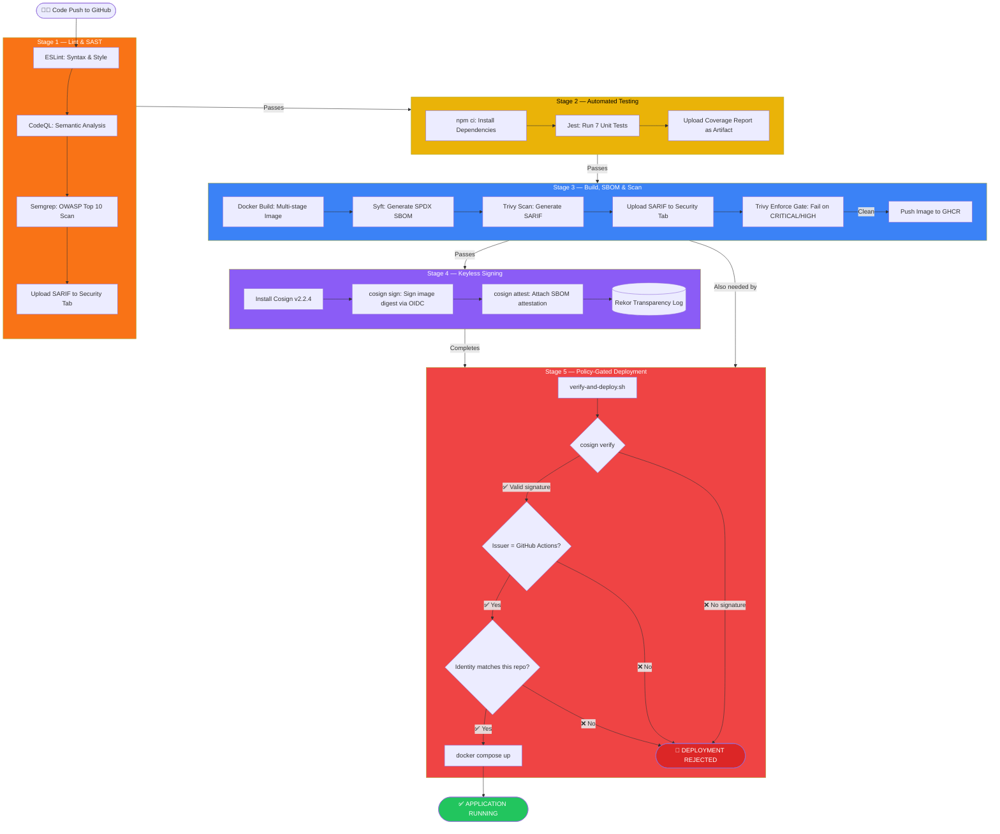
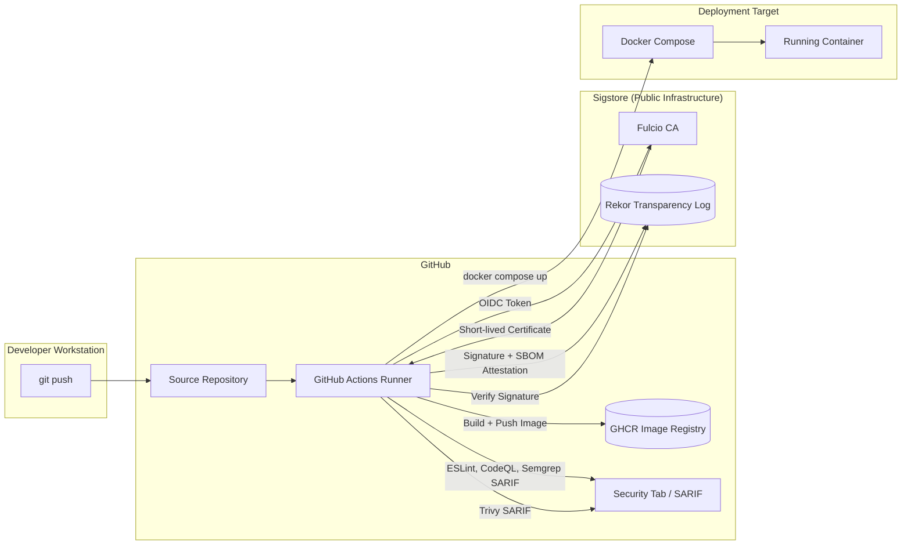

# Architecture: Zero-Trust DevSecOps Pipeline

## Overview

This pipeline implements a software supply-chain security model where **no artifact is trusted by default**. Every stage either proves the artifact's integrity or rejects it entirely. The pipeline is defined in [`.github/workflows/pipeline.yml`](../.github/workflows/pipeline.yml) and is automatically triggered by a `git push` to the `main` branch.

---

## Pipeline Flow Diagram



---

## Stage-by-Stage Data Flow

### Stage 1 — Lint & SAST
**Input:** Raw source code from the GitHub repository.

**Process:**
- `ESLint` parses `src/` and `test/` for JavaScript syntax errors and style violations using rules defined in `.eslintrc.json`.
- `CodeQL` builds an abstract code model and performs queries to detect security vulnerabilities that static pattern matching cannot find (e.g., tainted data flows, prototype pollution).
- `Semgrep` scans for known insecure code patterns using the community `javascript` and `owasp-top-ten` rulesets.

**Output:** SARIF report files uploaded to the GitHub Security tab. Workflow fails if ESLint exits non-zero.

**Zero-Trust Principle:** *Source code is untrusted until statically verified to be free of known security patterns.*

---

### Stage 2 — Automated Testing
**Input:** Source code after passing Stage 1.

**Process:**
- `npm ci` performs a clean, reproducible install from `package-lock.json` (no floating versions).
- `jest` runs all 7 tests with coverage instrumentation enabled.
- Coverage report is uploaded as a workflow artifact with a 7-day retention policy.

**Output:** A green test suite confirming application logic is correct. Coverage artifacts.

**Zero-Trust Principle:** *Application behaviour is untrusted until proven correct by automated tests.*

---

### Stage 3 — Build, SBOM & Scan
**Input:** Source code after passing Stage 2.

**Process:**
1. **Docker Buildx** performs a multi-stage build:
   - Stage 1 (`build`): Installs only `--omit=dev` production dependencies.
   - Stage 2 (`runtime`): Copies only the app code and `node_modules` into a minimal Alpine image. Creates a non-root `appuser`.
2. **Syft** inspects the built image and catalogues every OS package and npm dependency into an SPDX-JSON SBOM file.
3. **Trivy** scans the image against its vulnerability database, filtering for `CRITICAL` and `HIGH` severity issues that have known fixes (ignoring unfixable ones and those documented in `.trivyignore`).
4. If Trivy finds no blocking issues, the image is pushed to GHCR with two tags: `latest` and `sha-<commit-hash>`.

**Output:** A hardened, scanned, vulnerability-free Docker image in GHCR. An SBOM artifact. Trivy SARIF report in the Security tab.

**Zero-Trust Principle:** *A container image is untrusted until its contents are fully catalogued and scanned for known vulnerabilities.*

---

### Stage 4 — Keyless Signing
**Input:** The image digest output from Stage 3.

**Process:**
- GitHub Actions provides an OIDC token that proves the workflow's identity (which repository, which workflow file, which commit triggered it).
- `cosign sign` uses this token to request a short-lived signing certificate from **Fulcio** (the Sigstore CA). No private key is ever stored.
- The signature is published to the **Rekor** public transparency log — a cryptographically-verifiable, append-only ledger. Anyone in the world can verify that this specific image was signed by this specific GitHub Actions workflow.
- `cosign attest` also attaches the SBOM as a verifiable attestation to the image, proving the SBOM is authentic.

**Output:** A signed container image. An entry in the Rekor public transparency log. An SBOM attestation.

**Zero-Trust Principle:** *An unsigned image has no provenance. After this stage, the image's origin is cryptographically provable.*

---

### Stage 5 — Policy-Gated Deployment
**Input:** The signed image digest and Cosign, after Stage 4 completes.

**Process:**
The [`scripts/verify-and-deploy.sh`](../scripts/verify-and-deploy.sh) script enforces three conditions **before** any deployment command is run:

```
cosign verify \
  --certificate-issuer "$EXPECTED_ISSUER" \
  --certificate-identity-regexp "$EXPECTED_IDENTITY_REGEX" \
  "$IMAGE"
```

| Check | Value | Purpose |
|---|---|---|
| `--certificate-issuer` | `https://token.actions.githubusercontent.com` | Proves the signature came from GitHub Actions, not a personal machine |
| `--certificate-identity-regexp` | `^https://github.com/rudralaheri/devopsca/.*` | Proves it came from *this specific repository*, not any other |
| Image Digest | `sha256:...` | Verifies the content hasn't been tampered with since it was signed |

If all three pass, `docker compose up` is called. If any one fails, the script exits with code 1 and the pipeline fails.

**Output:** A running, verified application container — or a rejected deployment with a clear audit log.

**Zero-Trust Principle:** *"Never trust, always verify." The deployment environment trusts nothing from the registry; it independently verifies every claim.*

---

## Component Diagram


